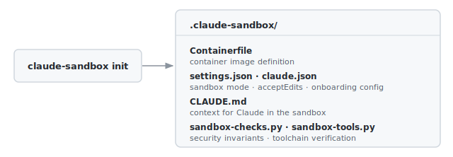

# claude-sandbox

When using Claude Code for real work, you want it to make changes freely without interrupting
you for permission on every file. But you also don't want it touching anything outside your
project. `claude-sandbox` runs Claude Code in a Linux container with only your project directory
mounted, so it has the access it needs and nothing more. It gives you a simple workflow to
initialize, build, and run a container with the latest Claude Code pre-installed, sandboxed,
and ready to work on your project. Under the hood, it uses [Apple container VMs][containers] for
isolation, Claude Code's built-in [sandbox mode][sandbox] to confine shell commands within the
container, and [acceptEdits][permissions] mode so Claude can edit files without prompting you.

### Installation

```bash
cargo install --git https://github.com/aldrin/claude-sandbox.git
```

### Usage

Normally, you'd go into a project directory and run `claude` to start a session. With
`claude-sandbox`, you do the same thing — except instead of running Claude Code directly on your
Mac, you end up in a sandboxed container with the same Claude interface, and your project mounted
inside it. There's a one-time setup per project: `init` creates a `.claude-sandbox/` directory
with a container image definition and Claude configuration, and `build` builds the image. After
that, `run` is all you need.

`init` creates a `.claude-sandbox/` directory in your project with a `Containerfile` defining
the container image (Alpine Linux with Claude Code and your developer tooling), default settings
that enable sandbox mode and `acceptEdits` permissions, and a `CLAUDE.md` to orient Claude Code
when it runs in the container. Edit the `Containerfile` to add language toolchains or tools your
project needs, and `settings.json` to adjust Claude's permissions.

<p align="center"></p>

`build` invokes the container CLI to build the image from `.claude-sandbox/Containerfile`. Make
sure the Apple container system is running first — if not, start it with `container system start`.
The build command runs:

```bash
container build -t claude-sandbox -f .claude-sandbox/Containerfile .claude-sandbox
```

This pulls in Claude Code and your developer tooling, so it takes a few minutes the first time.
Re-run it only when you update the `Containerfile`.

`run` launches Claude Code in the image you built, with your project mounted. It reads your
Claude OAuth token from the macOS keychain and passes it into the container as an environment
variable. If you haven't authenticated yet, run `claude auth login` first — that's what
populates the keychain.

<p align="center"></p>

By default, the container gets 2 CPUs and 4 GB of memory. Use `--cpus` and `--memory` to adjust
(both accept values between 2 and 8). The container is destroyed on exit.

> **Note:** The token never appears in the command line on your Mac, but is visible via
> `container inspect` and in the environment of any shell running inside the container.

A successful run looks like this. Use `/doctor` to confirm the sandbox is active — version
numbers in your output will differ, but the general structure should match.

```
    ✻
    |
   ▟█▙     Claude Code v2.1.50
 ▐▛███▜▌   Sonnet 4.6 · Claude API
▝▜█████▛▘  /home/claude
  ▘▘ ▝▝

❯ /doctor

 Diagnostics
 └ Currently running: native (2.1.50)
 └ Path: /home/claude/.local/share/claude/versions/2.1.50
 └ Invoked: /home/claude/.local/share/claude/versions/2.1.50
 └ Config install method: native
 └ Search: OK (rg)

 Updates
 └ Auto-updates: disabled (DISABLE_AUTOUPDATER set)
 └ Auto-update channel: latest
 └ Stable version: 2.1.39
 └ Latest version: 2.1.50

 Sandbox
 └ Status: Available (with warnings)
 └ seccomp not available - unix socket access not restricted

 Version Locks
 └ Cleaned 1 stale lock(s)
 └ No active version locks
```

[containers]: https://github.com/apple/containerization
[sandbox]: https://code.claude.com/docs/en/sandboxing
[permissions]: https://code.claude.com/docs/en/permissions
