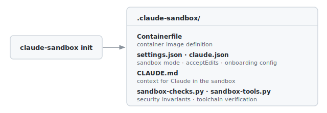
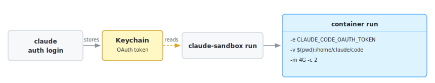

# claude-sandbox

When using Claude Code for real work, you want it to make changes freely without interrupting
you for permission on every file. But you also don't want it touching anything outside your
project. `claude-sandbox` runs Claude Code in a Linux container with only your project directory
mounted, so it has the access it needs and nothing more.

It gives you a simple workflow to initialize, build, and run a container with the latest Claude Code
pre-installed, sandboxed, and ready to work on your project. Under the hood, it uses [Apple
container VMs][containers] for isolation, Claude Code's built-in [sandbox mode][sandbox] to confine shell commands
within the container, and [acceptEdits][permissions] mode so Claude can edit files without
prompting you.

```bash
cargo install --git https://github.com/aldrin/claude-sandbox.git
```

### Usage

Normally, you'd go into a project directory and run `claude` to start a session. With
`claude-sandbox`, you do the same thing, except instead of running Claude Code directly on your
Mac, you end up in a sandboxed container with the same Claude interface, and your project mounted
inside it. There's a one-time setup per project: `init` creates a `.claude-sandbox/` directory
with a container image definition and Claude configuration, and `build` builds the image. After
that, `run` is all you need.

Each project gets its own container image. By default, the name is `claude-sandbox-<dirname>`,
derived from the current directory (lowercased, non-alphanumeric characters replaced with `-`).
You can override this with `--name` during init. The chosen name is saved in
`.claude-sandbox/image-name` and used automatically by `build` and `run`. This means you can
run multiple sandboxes simultaneously for different projects without conflicts.

- **`init`** creates a `.claude-sandbox/` directory in your project with a `Containerfile` defining
  the container image (Ubuntu 24.04 with Claude Code and your developer tooling), default settings
  that enable sandbox mode and `acceptEdits` permissions, a `CLAUDE.md` to orient Claude Code
  when it runs in the container, and git hooks that block commits from inside the sandbox so the
  host user retains ownership of the git history. Edit the `Containerfile` to add language
  toolchains or tools your project needs, and `settings.json` to adjust Claude's permissions.

  Use `--name` to choose a custom image name:

  ```bash
  claude-sandbox init --name my-project-sandbox
  ```

  <p align="center"></p>

- **`build`** invokes the container CLI to build the image from `.claude-sandbox/Containerfile`
  using the name chosen during init. Make sure the Apple container system is running first. If
  not, start it with `container system start`. For a project in `~/myapp`, the build command runs:

  ```bash
  container build -t claude-sandbox-myapp -f .claude-sandbox/Containerfile .claude-sandbox
  ```

  This pulls in Claude Code and your developer tooling, so it takes a few minutes the first time.
  Re-run it only when you update the `Containerfile`.

- **`run`** launches Claude Code in the image you built, with your project mounted. It reads your
  Claude OAuth token from the macOS keychain and passes it into the container as an environment
  variable. If you haven't authenticated yet, run `claude auth login` first, as that's what
  populates the keychain.

  <p align="center"></p>

  By default, the container gets 2 CPUs and 4 GB of memory. Use `--cpus` and `--memory` to adjust
  (both accept values between 2 and 8). The container is destroyed on exit.

  > **Note:** The token never appears in the command line on your Mac, but is visible via
  > `container inspect` and in the environment of any shell running inside the container.

  A successful run looks like this. Use `/doctor` to confirm the sandbox is active. Version
  numbers in your output will differ, but the general structure should match.

  ```
      ✻
      |
     ▟█▙     Claude Code v2.1.71
   ▐▛███▜▌   Sonnet 4.6 · Claude API
  ▝▜█████▛▘  /home/claude
    ▘▘ ▝▝

  ❯ /doctor

   Diagnostics
   └ Currently running: native (2.1.71)
   └ Path: /home/claude/.local/share/claude/versions/2.1.71
   └ Invoked: /home/claude/.local/share/claude/versions/2.1.71
   └ Config install method: native
   └ Search: OK (bundled)

   Updates
   └ Auto-updates: disabled (DISABLE_AUTOUPDATER set)
   └ Auto-update channel: latest
   └ Stable version: 2.1.58
   └ Latest version: 2.1.71

   Sandbox
   └ Status: Available (with warnings)
   └ seccomp not available - unix socket access not restricted

   Version Locks
   └ Cleaned 1 stale lock(s)
   └ No active version locks
  ```

### What's in the container

The default `Containerfile` includes:

- **Rust** — stable toolchain with `rust-analyzer`, `clippy`, `rustfmt`, and `rust-src`
- **Python** — `uv` for package management, `basedpyright` for type checking
- **DuckDB** — for data analysis; prefer it over loading data into Python when querying
  files, CSVs, Parquet, or JSON

Edit the `Containerfile` to add or remove tooling for your project.

### Settings

`settings.json` configures Claude Code's permission mode, sandbox, and runtime environment.
The `env` block contains variables grouped by purpose:

- **Terminal** — `COLUMNS`, `LINES`, `LANG`, and `COLORTERM` ensure proper terminal behavior
  inside the container.
- **Paths** — `TMPDIR` and `CARGO_TARGET_DIR` are set so Claude doesn't need to prefix every
  command with environment variables.
- **Claude Code** — `CLAUDE_CODE_DISABLE_NONESSENTIAL_TRAFFIC` turns off usage reporting, error
  callbacks, and feedback prompts. `CLAUDE_CODE_DISABLE_CRON`, `CLAUDE_CODE_DISABLE_AUTO_MEMORY`,
  and `CLAUDE_CODE_DISABLE_BACKGROUND_TASKS` disable features that don't apply in an ephemeral
  container.

[containers]: https://github.com/apple/container
[sandbox]: https://code.claude.com/docs/en/sandboxing
[permissions]: https://code.claude.com/docs/en/permissions
